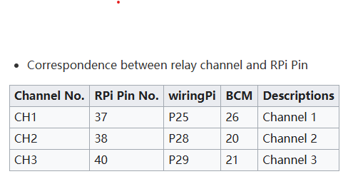
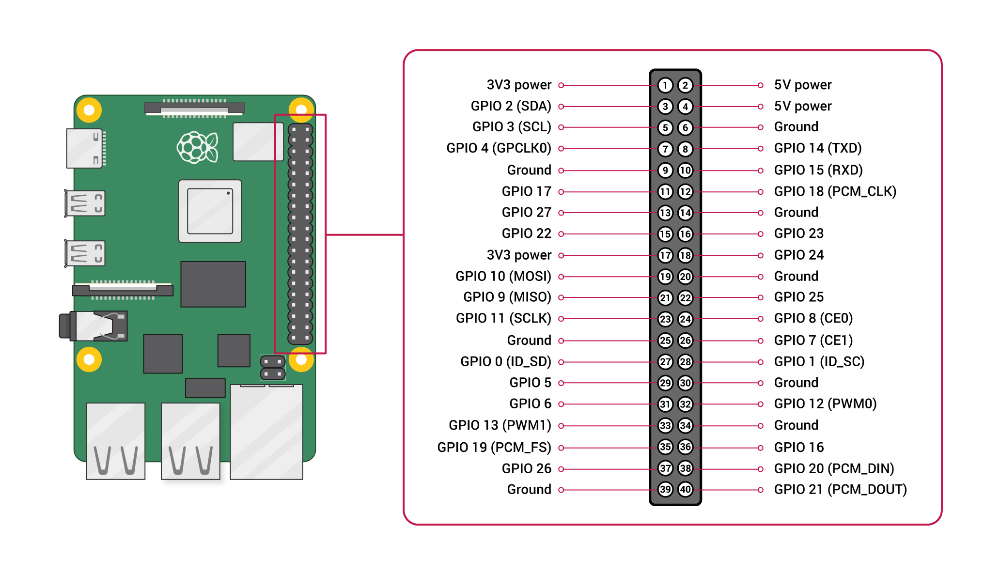

# Cat
Aquarium Led brightness and Co2 actuator control program by Raspi.

RelayBoard resource : https://www.waveshare.com/wiki/RPi_Relay_Board

Development Setting
===================
## install node js with nvm
sudo apt update
sudo apt install curl -y
curl -o- https://raw.githubusercontent.com/nvm-sh/nvm/v0.39.7/install.sh | bash
source ~/.bashrc
nvm install 16.16.0
nvm alias default 16.16.0
node -v
npm -v

## npm install settings
git config --global credential.helper store

===================
## install system fpm
sudo apt update\
sudo apt install ruby ruby-dev build-essential -y\
sudo apt install libgpiod-dev
